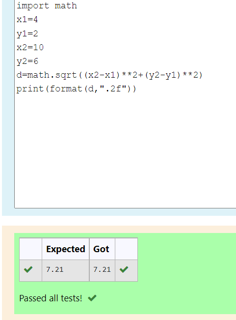

# DISTANCE-BETWEEN-TWO-POINTS

## AIM:
To write a python program to find the distance two 2 points
## ALGORITHM:
### Step 1: 
Commence the program
### Step 2: 
Enter the values from the user
### Step 3: 
Substitute the values in the distance formula d=√((x_2-x_1)²+(y_2-y_1)²)
### Step 4: 
Execute the result
### Step 5: 
Stop the program
### PROGRAM:
~~~
import math
x1=4
y1=2
x2=10
y2=6
d=math.sqrt((x2-x1)**2+(y2-y1)**2)
print(format(d,".2f"))
~~~
### OUTPUT:

### RESULT:
Thus the distance is calculated successfully.